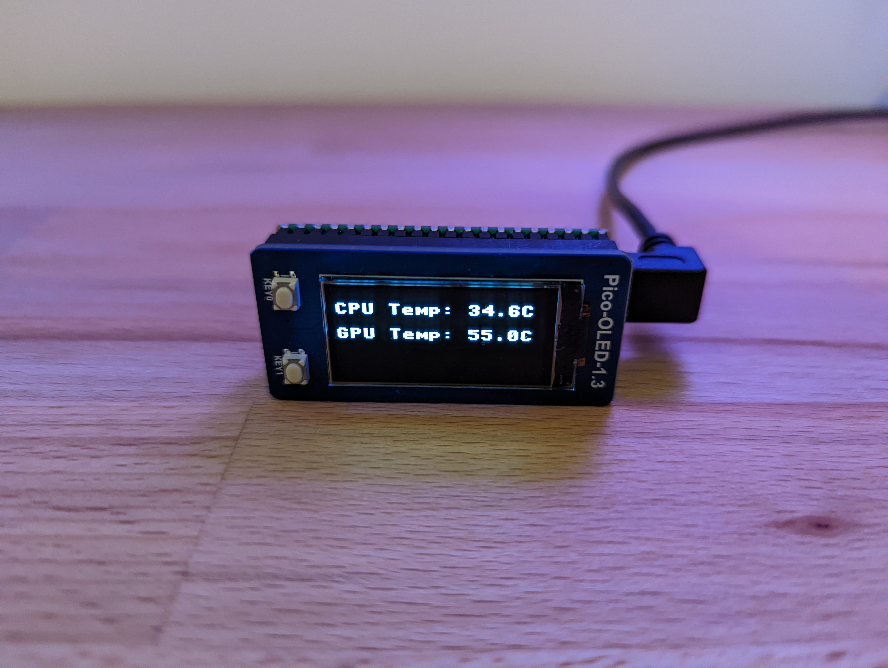

# Check your temps

This project displays your CPU + GPU temperature using a Raspberry Pi Pico with an OLED screen. It was built for a one-off
Christmas gift, don't expect too much in the way of stability or execution.



## Display

I used a [Raspberry Pi Pico with Pre-soldered Headers](https://thepihut.com/products/raspberry-pi-pico-with-pre-soldered-headers) 
(£6) and this [1.3" 64x128 OLED Screen](https://thepihut.com/products/1-3-oled-display-module-for-raspberry-pi-pico-64x128) 
(£8.50). I also used a [down-angled micro-USB cable](https://www.amazon.co.uk/gp/product/B00EBGGXS2/) (£5) for aesthetics 
but really any micro-USB cable would be fine.

You'll probably want [Thonny](https://thonny.org/) to [set up the pico for MicroPython](https://projects.raspberrypi.org/en/projects/getting-started-with-the-pico/3),
and copying the files in `pico/` on to the pico.

## Windows App

There's two parts to this. You need to get the app, then configure it to run on when you logon.

### Get the app

Easiest option is to use the latest [release on GitHub](https://github.com/Giqles/check-your-temps/releases).

#### Building from source
If you want to rebuild from scratch you need to have `virtualenv`. Then install the dependencies using:

```cmd
python -m virtualenv venv
.venv/Scripts/activate.bat
pip install -r requirements.txt
```

Using another environment with the `pyinstaller` package available, you then need to run (from a Command Prompt run as Administrator):

```cmd
pyinstaller --clean --paths .venv\Lib\site-packages --add-data OpenHardwareMonitorLib.dll;. check_your_temps.py
```

You should find the package constructed under the `dist/` subdirectory. You'll also have a `build/` subdirectory.

**Some issues you might run into**

To use `OpenHardwareMonitorLib.dll`, you might find you need to [unblock it](https://stackoverflow.com/questions/28840880/pythonnet-filenotfoundexception-unable-to-find-assembly) first.

When you build the installer, it might trigger alerts from antivirus software. That seems to be a [common issue with pyinstaller](https://stackoverflow.com/questions/43777106/program-made-with-pyinstaller-now-seen-as-a-trojan-horse-by-avg). I've implemented the easy suggestions in that thread.

If you have been running the app and want to make changes, you might need to disable any scheduled tasks and reboot first. If you don't, you
can end up with a file in the `dist/` subdir that you can't delete.

### Run the app when you log on

To do this, set up the app to run as high-permission background task on your system. For some reason
accessing the CPU temperature needs administrator permissions.

Launch a Command Prompt as Administrator. Then run (updating the path to the location on your system):

```cmd
schtasks /create /sc ONLOGON /tn checkmytemps /tr C:\FULL\PATH\TO\check_your_temps.exe /ru SYSTEM
```

That will make a scheduled task to run on log on called 'checkmytemps'. The task will run `check_your_temps.exe`
with System-level (ie very high) permissions. You can view the task by searching for 'Task Scheduler' in
the start menu. You can also manually start it from this interface. (Right-click --> Run)

The task can be a bit fragile. You can make it a bit more resilient by opening the task from Task Scheduler,
going to settings, and making it retry when failed up to some number of times. I set 3. There's probably a way to
do this from the CLI as well.

If you want to view the process itself, you'll see it under background tasks in task manager. On my system it uses
about 25MB of RAM, and about 0.1% of a CPU core.
